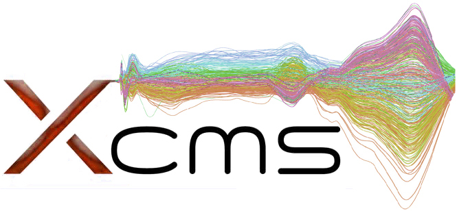

# XCMS
Version: 1.0.0

## Short Description

XCMS is a framework for processing and visualization of chromatographically separated and single-spectra mass spectral data.

## Description

XCMS is a framework for processing and visualization of chromatographically separated and single-spectra mass spectral data. Imports from AIA/ANDI NetCDF, mzXML, mzData and mzML files. Preprocesses data for high-throughput, untargeted analyte profiling.

The package also includes some R-scripts that realize various functions in the PhenoMeNal Galaxy:
- show-chromatogram: show a chromatogram of a single mzML file

## Key features

- Processing LC/MS and GC/MS data

## Approaches

- Metabolomics / Untargeted

## Instrument Data Types

- MS / LC-MS
- MS / GC-MS

## Tool Authors

- Colin A. Smith
- Ralf Tautenhahn
- Steffen Neumann
- Paul Benton
- Christopher Conley
- Johannes Rainer

## Container Contributors

- [Kristian Peters](https://github.com/korseby) (IPB-Halle)

## Website

- http://metlin.scripps.edu

## Git Repository

- https://github.com/sneumann/xcms

## Publications

- Benton HP, Wong DM, Trauger SA, Siuzdak G: XCMS2: Processing Tandem Mass Spectrometry Data for Metabolite Identification and Structural Characterization. Anal Chem 80(16):6382-6389. doi:10.1021/ac800795f.

